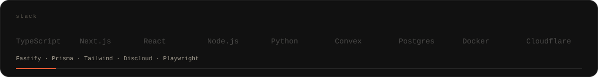
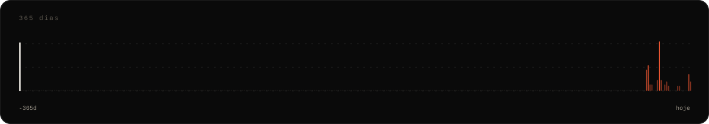

  

  <a href="https://menechan.lol">menechan.lol</a>
  &nbsp;·&nbsp;
  <a href="https://contasmurf.com">contasmurf.com</a>
  &nbsp;·&nbsp;
  <a href="https://monitordeconcursos.com">monitordeconcursos.com</a>

### `01`

Vibecodo até entrar no ar. Sites por assinatura pra pequeno negócio — a partir de R$ 50/mês.

### `02`

<table>
<tr>
<td width="50%">
  
</td>
<td width="50%">
  
</td>
</tr>
<tr>
<td width="50%">
  
</td>
<td width="50%">
  
</td>
</tr>
</table>

### `03`

### `04`

  

