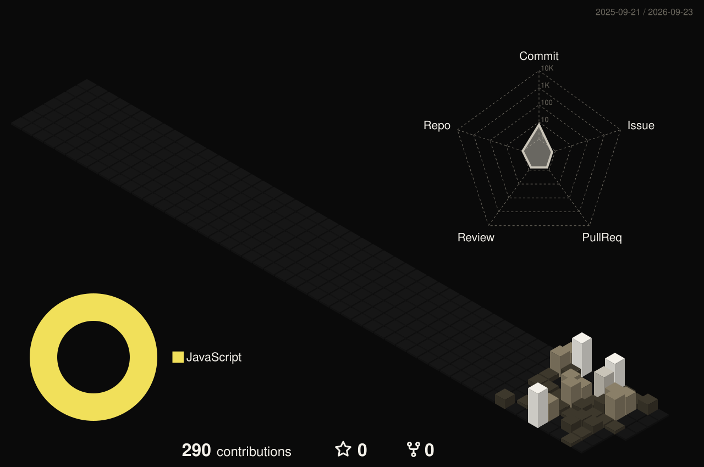
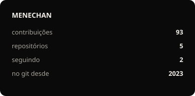
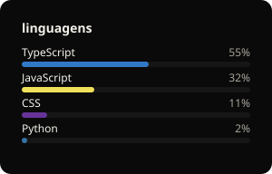

  

  
  
  
  

  

---

### `01` — agora

Vibecodo até entrar no ar.

Faço **sites por assinatura** pra pequeno negócio — criação, hospedagem e manutenção, a partir de R$ 50/mês. No resto do tempo, produto próprio.

  <a href="https://menechan.lol">menechan.lol</a>

---

### `02` — no ar

| | | |
| :--- | :--- | :--- |
| **[Monitor de Concursos](https://monitordeconcursos.com)** | concursos públicos, alertas e busca | Python · React · Vite |
| **[ContaSmurf](https://contasmurf.com)** | loja de contas LoL e smurf | Next.js · Fastify · Prisma |
| **[MENECHAN](https://menechan.lol)** | sites por assinatura | Next.js · Convex |

---

### `03` — stack

  

  Convex · Fastify · Discloud · Prisma

---

### `04`

  

  
  

  

  

